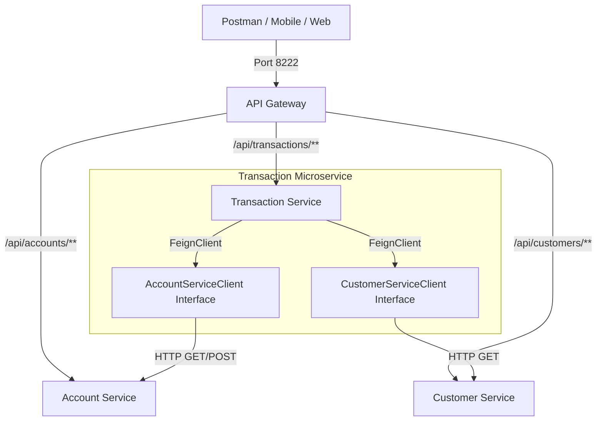

# FinBank - Bài Tập Tổng Hợp 4: Chuyển Đổi Sang FeignClient (OpenFeign)

## 1. Kiến Trúc Hệ Thống (Mermaid Diagram)



## 2. So Sánh Thực Tế: RestTemplate vs FeignClient (OpenFeign)

Sau khi chuyển đổi toàn bộ logic gọi API từ `RestTemplate` sang `FeignClient`, đội ngũ phát triển FinBank đưa ra một số nhận xét và so sánh thực tế như sau:

1. **Số lượng dòng code & Sự gọn nhẹ**: Với `RestTemplate`, dev phải tự khởi tạo URL, cấu hình `HttpHeaders`, đóng gói `HttpEntity`, chọn phương thức `.exchange()` và parse response DTO. Với `FeignClient`, ta chỉ cần khai báo một interface chứa signature phương thức và annotation (`@GetMapping`, `@PostMapping`), Spring Cloud OpenFeign sẽ tự động sinh implementation runtime. Code giảm tới 50-60% sự rườm rà.
2. **Độ dễ đọc và Bảo trì (Maintainability)**: Code sử dụng FeignClient trông giống như đang gọi một hàm local Java bình thường (`accountServiceClient.getAccount(...)`), giúp luồng xử lý nghiệp vụ chính trong `Service` cực kỳ rõ ràng, không bị lẫn các chi tiết kỹ thuật của HTTP transport layer.
3. **Khả năng tích hợp Microservice**: FeignClient tự động tích hợp tốt với các công cụ trong hệ sinh thái Spring Cloud như Eureka (Service Discovery), Resilience4j/Hystrix (Circuit Breaker & Retry), và Micrometer (Tracing/Logging) mà không cần viết code tùy chỉnh phức tạp như với RestTemplate.

## 3. Hướng Dẫn Chạy & Testing Qua API Gateway (Port 8222)

### API Endpoints
- **Thực hiện chuyển tiền**: `POST http://localhost:8222/api/transactions/transfer`
  - **Body (JSON)**:
    ```json
    {
      "fromAccountNumber": "ACC1001",
      "toAccountNumber": "ACC1002",
      "amount": 500.00,
      "description": "Chuyen tien thanh toan hoa don"
    }
    ```
- **Xem chi tiết giao dịch tổng hợp (Transaction + Account + Customer)**:
  - `GET http://localhost:8222/api/transactions/1/detail`
  - **Response (JSON)**:
    ```json
    {
      "transactionId": 1,
      "amount": 500.00,
      "description": "Chuyen tien thanh toan hoa don",
      "fromAccountNumber": "ACC1001",
      "toAccountNumber": "ACC1002",
      "customerName": "Nguyen Van A",
      "customerEmail": "nguyenvana@gmail.com",
      "status": "SUCCESS"
    }
    ```